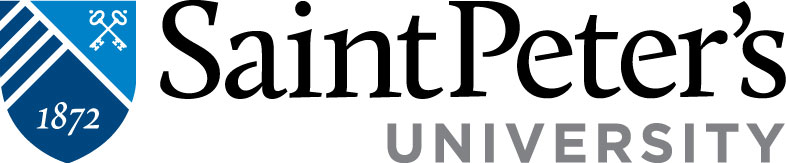

  

# DS 210 - Data Science and A.I. Principles
     
 <u>**[View Welcome Video](https://drive.google.com/file/d/1_SSYtBMzHD8QUnMaq8gjkUolrqXFUVYA/view?usp=sharing)**</u>

  

## Course Description 

  
    
This course provides students with a foundational understanding of data science and artificial intelligence (AI) principles. We'll explore how to extract valuable information and knowledge from data, applying these concepts to real-world scenarios in business and other fields.

Students will learn key methods in data science and AI, including predictive modeling, data visualization, and clustering analysis. We'll also cover essential topics like probability distributions, Bayes' theorem, and statistical inference. The course addresses decision analytic thinking, data and business strategy, as well as the challenges of cloud storage and big data analytics.

#### Why you should know this

Understanding data science and AI equips students with critical thinking skills, opening doors to vast career opportunities in tech, finance, healthcare, and beyond. PLUS, learning theses principles will be rooted in **Jesuit values**, enables students to leverage data-driven insights to make decisions with **discernment**, foster a commitment to **social justice**, and drive meaningful changes for **the greater good of others**.

## Course Specifics

  
**Course Delivery**: 

Synchronous; In-Person | 16 weeks

**Course Credits**: 

3 units | 35 Contact Hours | Term

## Program Student Learning Outcomes

1. Explore data science and AI's latest trends
2. Recognize database query concepts
3. Apply fundamental statistical modeling
4. Use basic machine learning algorithms
5. Evaluate industry-standard software
6. Describe business data utilization
7. Analyze real-world datasets

#### Course Student Learning Outcomes
  
Upon successful completion of this course, you will be (BETTER) able to ...
- Problem solve and analyze data utilizing effective critical thinking skills
- Demonstrates an understanding and application of Jesuit ideals and ethics
- Use of media tools to promoting positive change in the community while exploring growth in service and justice
- Supports teamwork through respect and inclusivity while enhancing leadership qualities

## Schedule

**Class Location:** Dinneen Hall, G-27

**Term Dates:** Wednesday, August 27 – Wednesday, December 10, 2024 (16 weeks)

**Class Times:** Monday, Wednesday, Thursday at 11:00am–11:50am (42 class sessions)

<u>**[UNIVERSITY WIDE Final Exam Schedule](https://www.saintpeters.edu/enrollment-services/records-and-registration/final-exam-schedule/)**</u>

| Week |         Start Date          |                 Topics                  |
|:---|:---|:---|
|  1 |  08.26      | WELCOME!! Code of Ethics in Data Science the Jesuit Way|
|  2 |  09.02    | Multi-disciplinary Data Scientist thru an Equity Lens |
|  3 |  09.08    | Data Analysis Life Cycle: Visit Admissions Program |
|  4 |  09.15   | Database Meaning and Interconnectedness in All Things: Visit Athletic Program |
| 5 |  09.22   | Decision Modeling and Discernment: Visit Career Engagement and Experiential Learning Program |
| 6 |  09.29   | R Analytics and Global Studies: Visit Criminal Justice Program |
| 7 |  10.06      | Data Python and Human Communication: Visit Fine Arts - Music Program |
| 8 |  10.13     | Midterm Exam: Visit English Program |
| 9 |  10.22     | Natural Language Processing: Visit Political Science and Communications Program |
| 10 |  10.27     | Cultural Analytics: Data Dissemination Specialist from the Census Bureau |
| 11 |  11.03     | Data Visualization and Business Intelligence: High School Leadership Mentor Program |
| 12 |  11.10    | Data Storytelling and Sustainability: Visit Fine Arts - Graphic Design Program|
| 13 |  11.17    | Machine Learning and Marginalized Communities: Visit Data Science Institute Program |
| 14 |  11.24    | Final Exam Overview and Ethic Principles|
| 15 |  12.01     | Term Group Project: Echos of Insight Podcast |
| 16 |  12.08     | CELEBRATION!! Term Group Project Presentation |
| 17 |  12.17     | FINAL EXAM - Mock Job Interview (12:00pm - 2:30pm)|

**Chat Hours:**

Monday 10:00am – 10:50am

Wednesday 4:00pm - 6:00pm

Thursday 2:00pm – 4:00pm

<u>[Book a Time to Chat](https://calendar.app.google/apFGmgQ2Ah4dPi8K7)</u>

**Office Location:**
Dinneen Hall, G-33 

**E-mail:**
gguerrero@saintpeters.edu
 
## Class Assignments

We will be using <u>[Blackboard](https://saintpeters.blackboard.com/)</u>, which allows us to provide fast and accurate feedback on your work.  <em>All assigned work will be submitted through Blackboard and assignment and exam grades will be returned through Blackboard.</em>

As soon as grades are posted, you will be notified immediately so that you can log in and see your feedback. You may also submit regrade requests if you feel we have made a mistake.

Your Blackboard login is your Saint Peter's University email, and your password can be changed at <u>[Saint Peter's Technology Services](https://saintpeters.teamdynamix.com/TDClient/1977/Portal/Home/)</u>. 

If you need additional support, <u>[CASE](https://www.saintpeters.edu/case/)</u>, the <u>[STEM Center](https://www.saintpeters.edu/centers-institutes/stem-engagement-center/)</u> and the <u>[Writing Studio](https://www.saintpeters.edu/writing-studio/)</u> programs are available as well as an online tutoring service <u>[Tutor.com](https://docs.google.com/forms/d/e/1FAIpQLSeGwoAaOI4g7ezrLLBNxcU7xStNg6kBlq3N4CkpmJ9dbp0MAg/viewform)</u>.

## Evaluation

To pass this course, every class is a chance to learn something new! 
Use the following guidelines::

- Find a support system that will cheer 🎉 you on to complete all classwork 
- Actively contributing to the group project helps build teamwork to complete the checklist ✅
- Create a study group 📚 to pass the midterm exam
- Pass the final mock job interview 🤔 according to the rubric WE (instructor and student) design together
- By attending and participating, you're building a stronger foundation for your learning journey 🚙
- Missed a deadline ☠️ do it anyway to get some credit

Your final grade will be based on:
- Check-in Assessments 10%
- Discussion Jesuit Value Sound Bytes 10%
- Homework/Classwork 25% 
- Term Group Project 15% 
- Midterm Exam 15% 
- Mock Job Interviews 25% 

#### Performance Evaluation Criteria

The following grading scale will be used in this class.

| Letter Grade |       Performance       |    Numeric Grade    |   QP    |
|:---|:---|:---|:---|
| A  |   Outstanding              |  94 - 100       |  4.0  |
| A- |   Excellent                |  90 - 93        |  3.7  |
| B+ |   Very Good                |  86 - 89        |  3.3  |
| B  |   Good                     |  83 - 85        |  3.0  |
| B- |   Above Average            |  79 - 82        |  2.7  |
| C+ |   Average                  |  75 - 78        |  2.3  |
| C  |   Satisfactory             |  70 - 74        |  2.0  |
| C- |   Below Average            |  66 - 69        |  1.7  |
| D+ |   Poor yet Passing         |  63 - 65        |  1.3  |
| D  |   Minimum for Credit       |  60 - 62        |  1.0  |
| F  |   Failure for the Course   |  59 - below     |  0.0  |

FA = Faculty has the option of giving an FA grade to students exceeding the number of permitted absences.

##  Information Resources

Resources you may need can be found here and accessible online or reserve through the O'Toole library at Saint Peter's university: 

#### OER (Open Education Resource) Textbooks
Anthony, Y. (2024). <em>Statistics Through an Equity Lens.</em> ROTEL Project, United States. Retrieved from [https://rotel.pressbooks.pub/statisticsthroughequitylens/](https://rotel.pressbooks.pub/statisticsthroughequitylens/).

Felvegi, E. (2024). <em>Open Data Cases.</em> Simplebook Publishing, United States. Retrieved from [https://uhlibraries.pressbooks.pub/opendatacases/](https://uhlibraries.pressbooks.pub/opendatacases/).

Library, U.Q. (2024). <em>Work with Data and Files.</em> University of Queenlands Pressbooks, United Kingdom. Retrieved from [https://uq.pressbooks.pub/digital-essentials-data-and-files/](https://uq.pressbooks.pub/digital-essentials-data-and-files/).

#### ProQuest Ebooks
Kenett, R. S., & Redman, T. C. (2019). <em>The real work of data science : Turning data into information, better decisions, and stronger organizations. </em> John Wiley & Sons, Incorporated. ProQuest Ebook Central, [https://ebookcentral.proquest.com/lib/stpu/reader.action?docID=5741750](https://ebookcentral.proquest.com/lib/stpu/reader.action?docID=5741750).

Stuart, D. (2020). <em>Practical Data Science for Information Professionals.</em> Facet Publishing. ProQuest Ebook Central, [https://ebookcentral.proquest.com/lib/stpu/detail.action?docID=6244431](https://ebookcentral.proquest.com/lib/stpu/detail.action?docID=6244431).

## Institution Policies

<u>[Code of Conduct, Equity, and Inclusion](https://www.saintpeters.edu/dean-of-students/)</u>

Learn about Student Conduct inspired by the Jesuit ideal of Men and Women for and With Others.

<u>[Academic Honesty](https://catalogs.saintpeters.edu/undergraduate/introduction/academicpoliciesandregulations/#:~:text=Academic%20Dishonesty)</u>

Saint Peter's University policies around plagiarism, cheating, and other forms of academic <u>[authenticity](https://drive.google.com/file/d/1zUvgX0PLXoN73U6yOeTeYJDomUvqFJea/view?usp=sharing)</u>.

<u>[Attendance Policy](https://catalogs.saintpeters.edu/undergraduate/introduction/academicpoliciesandregulations/#:~:text=Class%20Attendance)</u>

What we expect from you in terms of attendance for all classes at Saint Peter's University

<u>[Disability Services (Academic Accommodations)](https://catalogs.saintpeters.edu/undergraduate/introduction/academicpoliciesandregulations/#:~:text=Students%20with%20Disabilities)</u>

Services and accommodations Saint Peter's University provide for students

<u>[Student Handbook](https://catalogs.saintpeters.edu/handbook/)</u>

Guidelines, policies, and resources for all Saint Peter's University students

