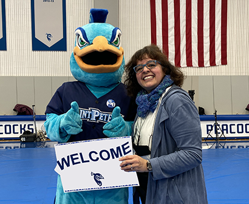

  

# DS 210 - Introduction to Data Science
     
### [Welcome Video](https://drive.google.com/file/d/1_SSYtBMzHD8QUnMaq8gjkUolrqXFUVYA/view?usp=sharing)

  

## Course Description 

  

Data Science is a set of fundamental principles that guide the extraction of valuable information and knowledge from data. This course provides an overview and develops student’s understanding of the data science and analytics landscape in the context of business examples and other emerging fields. It also provides students with an understanding of the most common methods used in data analysis. Topics covered include introduction to predictive modeling, data visualization, probability distributions, Bayes’ theorem, statistical inference, clustering analysis, decision analytic thinking, data and business strategy, cloud storage and big data analytics.

#### Why you should know this

Understanding data science equips you with critical thinking skills and the ability to analyze real-world problems, opening up vast career opportunities in tech, finance, healthcare, and beyond. By learning data science, you can leverage data-driven insights to make informed decisions and drive impactful changes for the greater good of others.

## Prerequisites  

- [DS 310 Principles of Data Mining](https://www.saintpeters.edu/academics/undergraduate-programs/data-science/courses/)

## Course Specifics

  
**Course Delivery**: 

Synchronous; In-Person | 14 weeks | 42 sessions

**Course Credits**: 

3 units | 35 Contact Hours/Term

## Program Student Learning Outcomes

1. Discuss data science trends and skills
2. Understand database query concepts
3. Apply fundamental statistical modeling
4. Use basic machine learning algorithms
5. Preview industry-standard software
6. Describe business data utilization
7. Analyze real-world datasets

#### Course Student Learning Outcomes
  
Upon successful completion of this course, you will be (BETTER) able to ...
- Problem solve and analyze data
- Utilize effective critical thinking skills

## Schedule

**Class Location:** Dinneen Hall, G36

**Term Dates:** Wednesday, August 28 – Tuesday, December 17, 2024 (17 weeks)

**Class Times:** Monday, Wednesday, Thursday at 11:00am–11:50am (42 class sessions)

| Class |          Date          |                 Topics                  |
|:-----:|:----------------------:|:---------------------------------------:|
|  1 |  Wed, August 28      | WELCOME!! |
|  2 |  Thurs, August 29    | In-Class Assessment |
|  - |  Mon, September 2    | **No Class - Labor Day** |
|  3 |  Wed, September 4    | Probability Basics |
|  4 |  Thurs, September 5  | In-Class Assessment |
|  5 |  Mon, September 9    | Exploratory Data Analysis |
|  6 |  Wed, September 11   | Interdisciplinary Research |
|  7 |  Thurs, September 12 | In-Class Assessment |
|  8 |  Mon, September 16   | Database Queries/SQL |
|  9 |  Wed, September 18   | Interdisciplinary Research |
| 10 |  Thurs, September 19 | In-Class Assessment |
| 11 |  Mon, September 23   | Regression |
| -  |  Wed, September 25   | **No Class - Michaelmas Convocation** |
| 12 |  Thurs, September 26 | In-Class Assessment |
| 13 |  Mon, September 30   | R Analytics |
| 14 |  Wed, October 2      | Interdisciplinary Research |
| 15 |  Thurs, October 3    | Midterm Exam |
| 16 |  Mon, October 7      | R Analytics |
| 17 |  Wed, October 9      | Interdisciplinary Research |
| 18 |  Thurs, October 10   | In-Class Assessment |
| 19 |  Mon, October 14     | Data Python |
| 20 |  Wed, October 16     | Interdisciplinary Research |
| 21 |  Thurs, October 17   | In-Class Assessment |
| 22 |  Mon, October 21     | Data Python |
| 23 |  Wed, October 23     | Interdisciplinary Research |
| 24 |  Thurs, October 24   | In-Class Assessment |
| 25 |  Mon, October 28     | Visual Insights |
| 26 |  Wed, October 30     | Interdisciplinary Research |
| 27 |  Thurs, October 31   | In-Class Assessment |
| 28 |  Mon, November 4     | Excel/PowerBi |
| 29 |  Wed, November 6     | Interdisciplinary Research |
| 30 |  Thurs, November 7   | In-Class Assessment |
| 31 |  Mon, November 11    | Tableau |
| 32 |  Wed, November 13    | Interdisciplinary Research |
| 33 |  Thurs, November 14  | In-Class Assessment |
| 34 |  Mon, November 18    | Data Storytelling |
| 35 |  Wed, November 20    | Interdisciplinary Research |
| 36 |  Thurs, November 21  | In-Class Assessment |
| 37 |  Mon, November 25    | Machine Learning |
| -  |  Wed, November 27    | **No Class - Thanksgiving Break** |
| -  |  Thurs, November 28  | **No Class - Thanksgiving Break** |
| 38 |  Mon, December 2     | Term Group Project |
| 39 |  Wed, December 4     | Term Group Project |
| 40 |  Thurs, December 5   | Term Group Project |
| 41 |  Mon, December 9     | CELEBRATION!! Term Group Project Presentation |
| 42 |  TBD                 | Final Exam - Mock Job Interview |

## Class Assignments

We will be using [Blackboard](https://saintpeters.blackboard.com/), which allows us to provide fast and accurate feedback on your work.  <em>All assigned work will be submitted through Blackboard and assignment and exam grades will be returned through Blackboard.</em>

As soon as grades are posted, you will be notified immediately so that you can log in and see your feedback. You may also submit regrade requests if you feel we have made a mistake.

Your Blackboard login is your Saint Peter's University email, and your password can be changed at [Saint Peter's Technology Services](https://saintpeters.teamdynamix.com/TDClient/1977/Portal/Home/). 

If you need additional support, tutoring is provided by the online service [Peardeck Tutor](https://tutor.peardeck.com/tutors/) part of Saint Peter's University or reach out to me directly for assistance.

## Evaluation

To pass this course you must meet the following requirements:

- Complete all required assessments 
- Pass the term group project according to the associated project rubric
- Pass the midterm summative assessment according to the exam rubric
- Pass the final mock job interview according to the rubric mutually designed
- Actively participate in class and abide by the attendance policy
- Make up all classwork from all absences

Your final grade will be based on:
- Check-in Assessments 10%
- Discussion Sound Bytes 10%
- Homework/Classwork 25% 
- Project 15% 
- Midterm Exam 15% 
- Mock Job Interviews 25% 

#### Grading Scale

The following grading scale will be used in this class.

| Letter Grade |          Average in Course          |
|:-----:|:----------------------:|
| A  |  94 - 100   |
| A- |  90 - 93    |
| B+ |  87 - 89    |
| B  |  83 - 86    |
| B- |  80 - 82    |
| C+ |  77 - 79    |
| C  |  73 - 76    |
| C- |  70 - 72    |
| D+ |  67 - 69    |
| D  |  60 - 66    |
| F  |  0 - 59     |

##  Information Resources

Resources you may need can be found here and accessible online or reserve through the O'Toole library at Saint Peter's university: 

#### OER (Open Education Resource) Textbooks
Anthony, Y. (2024). <em>Statistics Through an Equity Lens.</em> ROTEL Project, United States. Retrieved from [https://rotel.pressbooks.pub/statisticsthroughequitylens/](https://rotel.pressbooks.pub/statisticsthroughequitylens/).

Felvegi, E. (2024). <em>Open Data Cases.</em> Simplebook Publishing, United States. Retrieved from [https://uhlibraries.pressbooks.pub/opendatacases/](https://uhlibraries.pressbooks.pub/opendatacases/).

Library, U.Q. (2024). <em>Work with Data and Files.</em> University of Queenlands Pressbooks, United Kingdom. Retrieved from [https://uq.pressbooks.pub/digital-essentials-data-and-files/](https://uq.pressbooks.pub/digital-essentials-data-and-files/).

#### ProQuest Ebooks
Kenett, R. S., & Redman, T. C. (2019). <em>The real work of data science : Turning data into information, better decisions, and stronger organizations. </em> John Wiley & Sons, Incorporated. ProQuest Ebook Central, [https://ebookcentral.proquest.com/lib/stpu/reader.action?docID=5741750](https://ebookcentral.proquest.com/lib/stpu/reader.action?docID=5741750).

Stuart, D. (2020). <em>Practical Data Science for Information Professionals.</em> Facet Publishing. ProQuest Ebook Central, [https://ebookcentral.proquest.com/lib/stpu/detail.action?docID=6244431](https://ebookcentral.proquest.com/lib/stpu/detail.action?docID=6244431).

## Institution Policies

[Code of Conduct, Equity, and Inclusion](https://www.saintpeters.edu/dean-of-students/)

Learn about Student Conduct inspired by the Jesuit ideal of Men and Women for and With Others.

[Academic Honesty](https://www.saintpeters.edu/academics/college-of-arts-and-sciences/academic-dean/academic-policies-regulations/#:~:text=Academic%20Dishonesty)

Saint Peter's University policies around plagiarism, cheating, and other forms of academic authenticity

[Attendance Policy](https://www.saintpeters.edu/academics/college-of-arts-and-sciences/academic-dean/academic-policies-regulations/#:~:text=CLASS%20ATTENDANCE)

What we expect from you in terms of attendance for all classes at Saint Peter's University

[Disability Services (Academic Accommodations)](https://www.saintpeters.edu/academics/college-of-arts-and-sciences/academic-dean/academic-policies-regulations/#:~:text=STUDENTS%20WITH%20DISABILITIES)

Services and accommodations Saint Peter's University provide for students

[Student Handbook](https://catalogs.saintpeters.edu/handbook/)

Guidelines, policies, and resources for all Saint Peter's University students
